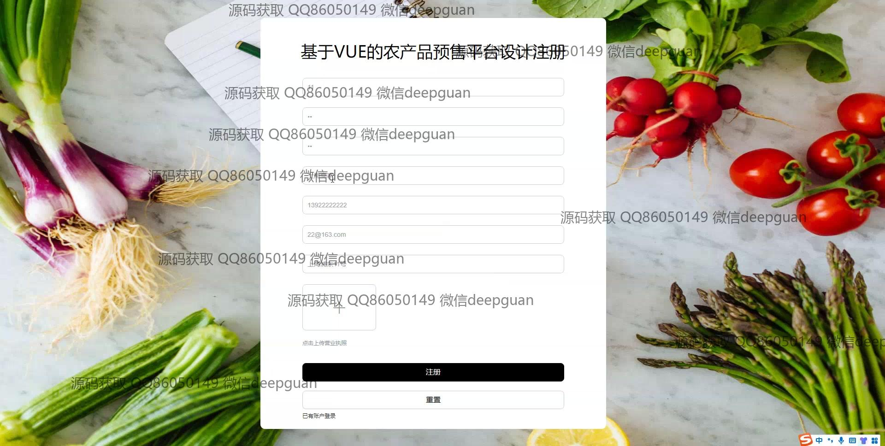
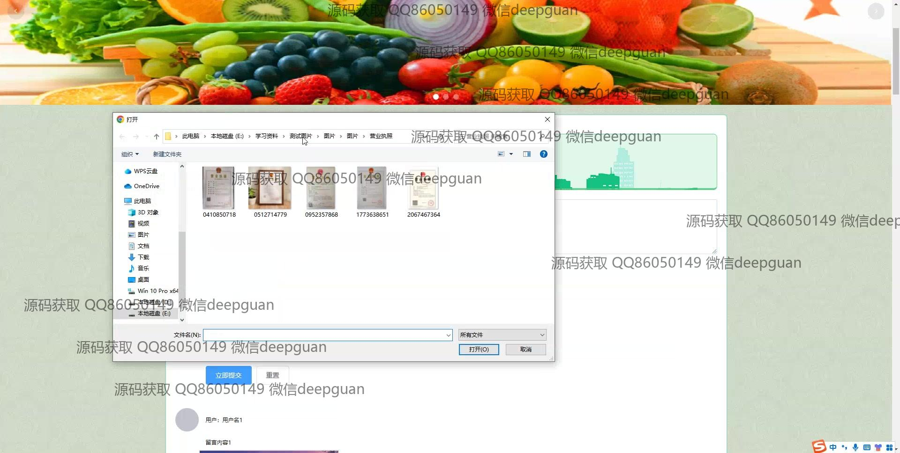
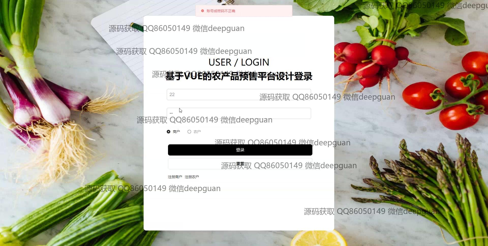

<h1 align="center">基于VUE的农产品预售平台设计</h1>

## 简介
基于VUE的农产品预售平台设计：该平台主要角色为管理员和用户，提供界面设计、订单管理、用户管理和支付系统集成功能，支持农产品的预售和库存管理，旨在简化交易流程，提升用户体验。    --计算机毕业设计源码；毕设源码；java毕业设计源码

## 联系方式

<h3 align="center">获取完整代码与数据库文件 + 微信：deepguan QQ: 86050149 QQ群: 783742310</h3>

<h3 align="center">可帮忙远程部署 包运行成功！提供远程部署、修改代码、设计文档指导、代码讲解等服务！</h3>

## 功能介绍（完整见运行截图）
管理员：管理员可通过平台管理用户注册与登录请求，维护与更新农产品库存、价格、采摘日期等信息，管理及审核订单状态并处理用户反馈。系统包含详细的订单、支付和退款信息表，便于管理员高效处理数据。此外，管理员还能管理和维护交流论坛的帖子，进行有关商品、商家及客户的信息统计，确保平台运营顺畅。

用户：用户注册后，可浏览并查看农产品详细信息包括价格、库存及采摘日期。通过使用购物车，用户能预订农产品并通过选择合适的支付方式完成订单。用户登录后，可在个人中心查看订单历史、地址信息和收藏夹，并管理账户信息。平台提供交流论坛功能，方便用户交流购买体验或问题。

## 运行截图

本代码来源于网络,仅供学习参考使用!

